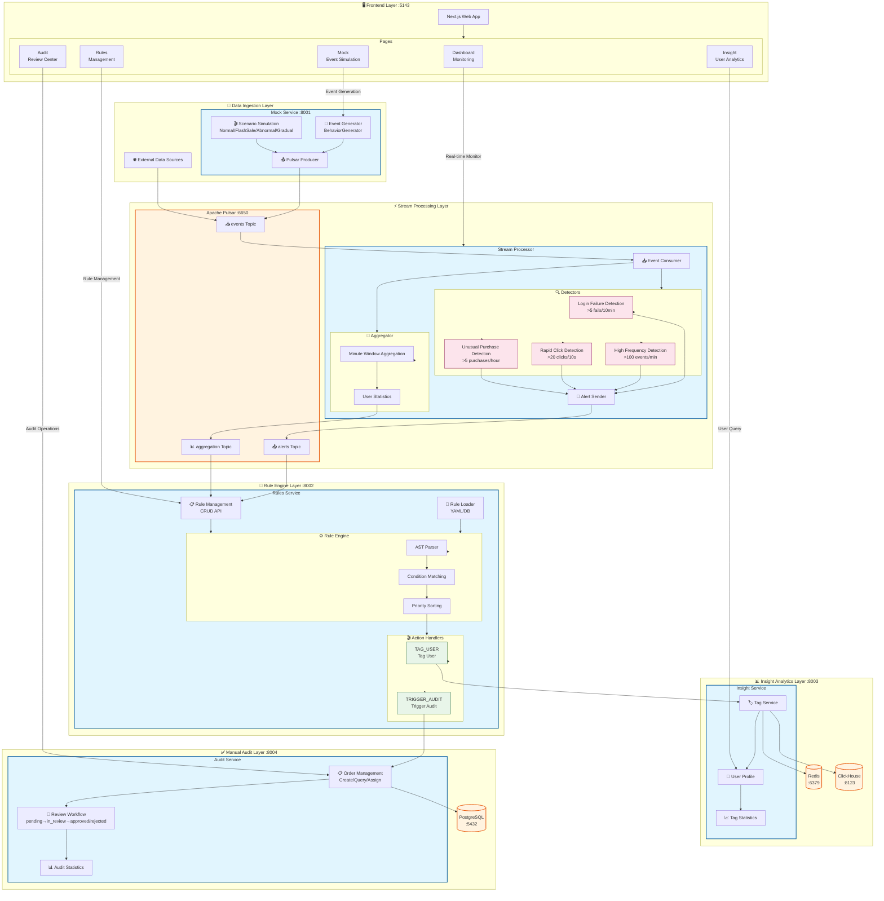

<h1 align="center">
  <br>
  <a href="#"></a>
  <br>
  BehaviorSense
  <br>
</h1>

<h4 align="center">Real-time User Behavior Stream Analytics Engine</h4>

<p align="center">
  <a href="#-why-behaviorsense">Why</a> •
  <a href="#-features">Features</a> •
  <a href="#-quick-start">Quick Start</a> •
  <a href="#-architecture">Architecture</a> •
  <a href="#-documentation">Documentation</a>
</p>

<p align="center">
  <a href="https://github.com/afine907/behavior-sense/actions/workflows/ci.yml">
    
  </a>
  <a href="https://www.python.org/downloads/">
    
  </a>
  <a href="LICENSE">
    
  </a>
  <a href="https://docs.astral.sh/ruff/">
    
  </a>
</p>

<p align="center">
  <a href="README.md">English</a> | <a href="README_CN.md">中文</a>
</p>

---

## 🎯 What Problem Does It Solve?

**Detect fraud, abuse, and anomalies in user behavior — in real-time, with sub-second latency.**

BehaviorSense is a production-ready engine that processes user behavior events (clicks, purchases, logins) through a flexible rule engine, automatically tags users based on patterns, and flags high-risk events for human review.

```
User clicks → Stream processes → Rules match → Auto-tag / Flag for audit
     ↓              < 1 second           ↓
  [Pulsar] ──────→ [Faust] ──────→ [Decision] ──────→ [Action]
```

---

## 💡 Why BehaviorSense?

| Pain Point | BehaviorSense Solution |
|------------|------------------------|
| **Rule changes require code deploy** | Hot-reload rules via YAML/DB — no restart needed |
| **SQL-based fraud detection is slow** | AST-based rule engine evaluates in milliseconds |
| **False positives need manual review** | Built-in human-in-the-loop audit workflow |
| **Can't see what's happening now** | Real-time dashboard + Prometheus metrics |
| **Monolith is hard to scale** | Microservices with independent deployment |

### 🚀 Innovations

- **⚡ Sub-second Latency** — From event to decision in < 1 second
- **🔥 Hot-reload Rules** — Add/modify rules without service restart
- **🛡️ Safe Rule Parsing** — AST-based evaluation prevents code injection
- **👥 Human-in the-loop** — Built-in audit workflow for high-stakes decisions
- **📊 Multi-layer Detection** — Pre-built detectors for login failures, rapid clicks, unusual purchases

---

## ✨ Features

<table>
<tr>
<td width="50%">

### 🎯 Rule Engine

```yaml
# rules/fraud_detection.yaml
- name: "High Value Purchase Alert"
  condition: "amount > 10000 and user_age_days < 7"
  priority: 10
  actions:
    - type: TAG_USER
      params: { tags: ["high_risk"] }
    - type: TRIGGER_AUDIT
      params: { level: "high" }
```

**Hot-reload enabled** — modify rules without restart

</td>
<td width="50%">

### 🔍 Built-in Detectors

| Detector | Threshold | Use Case |
|----------|-----------|----------|
| Login Failure | >5 fails/10min | Brute force attack |
| High Frequency | >100 events/min | Bot activity |
| Rapid Click | >20 clicks/10s | Click farming |
| Unusual Purchase | >5 same-item/hour | Reselling/fraud |

</td>
</tr>
</table>

### 🏗️ Full-Stack Solution

- **Frontend**: Next.js dashboard for monitoring & management
- **Backend**: 5 FastAPI microservices + Faust stream processor
- **Infrastructure**: Pulsar, PostgreSQL, Redis, ClickHouse
- **Observability**: Prometheus + Grafana dashboards

---

## 🚀 Quick Start

### Prerequisites

- Python 3.11+
- [uv](https://docs.astral.sh/uv/) package manager
- Docker & Docker Compose (for infrastructure)

### 5-Minute Setup

```bash
# 1. Clone
git clone https://github.com/afine907/behavior-sense.git
cd behavior-sense

# 2. Install dependencies
uv sync

# 3. Start infrastructure (Pulsar, PostgreSQL, Redis, etc.)
docker compose -f infrastructure/docker/compose/base.yml up -d

# 4. Start services (in separate terminals)
uv run uvicorn behavior_mock.main:app --port 8001      # Event generator
uv run python -m behavior_stream                        # Stream processor
uv run uvicorn behavior_rules.main:app --port 8002     # Rule engine
uv run uvicorn behavior_insight.main:app --port 8003   # User insights
uv run uvicorn behavior_audit.main:app --port 8004     # Audit workflow

# 5. Open dashboard
cd apps/web && pnpm install && pnpm dev
# → http://localhost:5143
```

### Generate Test Events

```bash
# Start a normal traffic scenario
curl -X POST http://localhost:8001/api/mock/scenario/start \
  -H "Content-Type: application/json" \
  -d '{"scenario_type": "normal", "rate_per_second": 100}'
```

---

## 📐 Architecture



---

## 🛠️ Tech Stack

| Layer | Technology | Why |
|-------|------------|-----|
| **Runtime** | Python 3.11+ | Async support, type hints |
| **Package Manager** | [uv](https://docs.astral.sh/uv/) | 10x faster than pip |
| **Web Framework** | FastAPI | Async, OpenAPI, type-safe |
| **Frontend** | Next.js 14 | React, SSR, App Router |
| **Stream Processing** | Faust | Kafka-like streaming in Python |
| **Message Queue** | Apache Pulsar | Multi-tenancy, geo-replication |
| **Database** | PostgreSQL | ACID, reliable |
| **Cache** | Redis | Fast, pub/sub support |
| **Analytics** | ClickHouse | OLAP for behavior analysis |
| **Monitoring** | Prometheus + Grafana | Industry standard |

---

## 📖 Documentation

| Document | Description |
|----------|-------------|
| [Architecture Design](wiki/architecture.md) | System architecture deep dive |
| [Module Design](wiki/modules.md) | Service responsibilities |
| [Technology Stack](wiki/technology.md) | Tech choices explained |
| [API Design](wiki/api.md) | REST API specifications |
| [Deployment Guide](wiki/deployment.md) | Production deployment |
| [Best Practices](wiki/best-practices.md) | FastAPI, Pydantic, SQLAlchemy patterns |

---

## 🧪 Testing

```bash
# Fast tests (no external dependencies)
uv run pytest tests/test_api/test_mock_api.py tests/test_api/test_rules_api.py -v

# Full integration tests (requires Docker)
docker compose -f infrastructure/docker/compose/test.yml up -d
TEST_REAL_DEPS=1 uv run pytest tests/ -v

# With coverage
uv run pytest tests/ --cov=libs --cov=packages --cov-report=html
```

---

## 🤝 Contributing

We welcome contributions! See [Contributing Guidelines](CONTRIBUTING.md).

### Commit Convention

All commits must follow [Conventional Commits](https://www.conventionalcommits.org/):

```
feat(audit): add audit state machine for review workflow
fix(rules): prevent eval injection with AST parser
docs(api): update endpoint documentation
```

---

## 📄 License

MIT License - see [LICENSE](LICENSE) for details.

---

<p align="center">
  <b>Star ⭐ this repo if you find it useful!</b>
</p>
