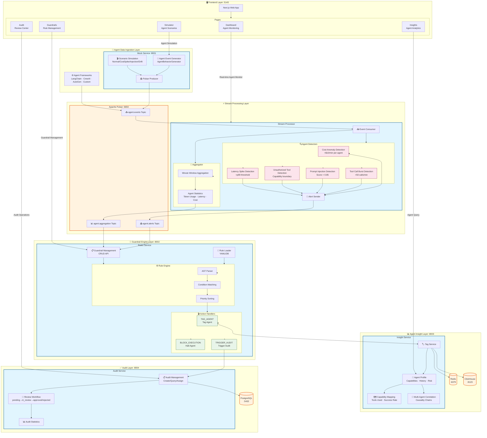

<h1 align="center">
  <br>
  <a href="#"></a>
  <br>
  BehaviorSense
  <br>
</h1>

<h4 align="center">Real-time AI Agent Behavior Analytics Engine</h4>

<p align="center">
  Monitor, analyze, and govern AI Agent behavior in real-time.
</p>

<p align="center">
  <a href="#-why-behaviorsense">Why</a> •
  <a href="#-features">Features</a> •
  <a href="#-quick-start">Quick Start</a> •
  <a href="#-architecture">Architecture</a> •
  <a href="#-documentation">Documentation</a>
</p>

<p align="center">
  <a href="https://github.com/afine907/behavior-sense/actions/workflows/ci.yml">
    
  </a>
  <a href="https://www.python.org/downloads/">
    
  </a>
  <a href="LICENSE">
    
  </a>
  <a href="https://docs.astral.sh/ruff/">
    
  </a>
</p>

<p align="center">
  <a href="README.md">English</a> | <a href="README_CN.md">中文</a>
</p>

---

## 🎯 What Problem Does It Solve?

**See everything your AI Agents do — trace every action, catch anomalies, and enforce guardrails in real-time.**

As teams deploy autonomous AI Agents that call tools, spend tokens, and interact with systems, visibility becomes critical. BehaviorSense is a production-ready engine that captures agent execution traces, detects cost anomalies and prompt injection attempts, maps capability usage, and flags risky behaviors for human review — all with sub-second latency.

```
Agent action → Stream processes → Rules match → Auto-tag / Flag for audit
     ↓              < 1 second           ↓
  [Pulsar] ──────→ [Faust] ──────→ [Decision] ──────→ [Action]
```

---

## 💡 Why BehaviorSense?

| Pain Point | BehaviorSense Solution |
|------------|------------------------|
| **No visibility into agent tool calls** | Full execution tracing with latency and cost breakdowns |
| **Token costs spiral out of control** | Real-time cost anomaly detection with per-agent budgets |
| **Prompt injection goes undetected** | AST-based prompt analysis catches injection patterns instantly |
| **Multi-agent systems are opaque** | Correlation engine links actions across agent workflows |
| **Guardrails require code changes** | Hot-reload safety rules via YAML — no redeploy needed |
| **Hard to audit autonomous decisions** | Built-in human-in-the-loop review workflow |

### 🚀 Innovations

- **⚡ Sub-second Latency** — From agent action to governance decision in < 1 second
- **🔥 Hot-reload Rules** — Add or modify guardrails without service restart
- **🛡️ Safe Rule Parsing** — AST-based evaluation prevents eval injection
- **🤖 Agent-native Tracing** — Purpose-built for LLM tool calls, token usage, and multi-step reasoning
- **🔗 Multi-Agent Correlation** — Track causality chains across agent handoffs
- **👥 Human-in-the-loop** — Built-in audit workflow for high-stakes agent decisions

---

## ✨ Features

<table>
<tr>
<td width="50%">

### 🎯 Agent Guardrail Engine

```yaml
# rules/agent_guardrails.yaml
- name: "High Token Cost Alert"
  condition: "token_cost > 5.00 and agent_role != 'planner'"
  priority: 10
  actions:
    - type: TAG_AGENT
      params: { tags: ["cost_anomaly"] }
    - type: TRIGGER_AUDIT
      params: { level: "high" }

- name: "Prompt Injection Detected"
  condition: "injection_score > 0.85"
  priority: 1
  actions:
    - type: BLOCK_EXECUTION
      params: { reason: "injection_detected" }
    - type: TRIGGER_AUDIT
      params: { level: "critical" }
```

**Hot-reload enabled** — modify guardrails without restart

</td>
<td width="50%">

### 🔍 Built-in Agent Detectors

| Detector | Threshold | Use Case |
|----------|-----------|----------|
| Cost Anomaly | >$10/minute per agent | Runaway token usage |
| Tool Call Burst | >50 calls/min | Agent stuck in a loop |
| Prompt Injection | Score > 0.85 | Malicious input hijacking |
| Unauthorized Tool | Blocked tool access | Capability boundary violation |
| Latency Spike | >5s p99 response | Degraded agent performance |

</td>
</tr>
</table>

### 🏗️ Full-Stack Solution

- **Frontend**: Next.js dashboard for agent monitoring and governance
- **Backend**: 5 FastAPI microservices + Faust stream processor
- **Infrastructure**: Pulsar, PostgreSQL, Redis, ClickHouse
- **Observability**: Prometheus + Grafana dashboards with agent-specific panels

---

## 🚀 Quick Start

### Prerequisites

- Python 3.11+
- [uv](https://docs.astral.sh/uv/) package manager
- Docker & Docker Compose (for infrastructure)

### 5-Minute Setup

```bash
# 1. Clone
git clone https://github.com/afine907/behavior-sense.git
cd behavior-sense

# 2. Install dependencies
uv sync

# 3. Start infrastructure (Pulsar, PostgreSQL, Redis, etc.)
docker compose -f infrastructure/docker/compose/base.yml up -d

# 4. Start services (in separate terminals)
uv run uvicorn behavior_mock.main:app --port 8001      # Agent event simulator
uv run python -m behavior_stream                        # Stream processor
uv run uvicorn behavior_rules.main:app --port 8002     # Rule engine
uv run uvicorn behavior_insight.main:app --port 8003   # Agent insights
uv run uvicorn behavior_audit.main:app --port 8004     # Audit workflow

# 5. Open dashboard
cd apps/web && pnpm install && pnpm dev
# → http://localhost:5143
```

### Simulate Agent Activity

```bash
# Start a normal multi-agent scenario (coding + research agents)
curl -X POST http://localhost:8001/api/mock/scenario/start \
  -H "Content-Type: application/json" \
  -d '{"scenario_type": "normal", "rate_per_second": 100}'

# Start an anomaly scenario (cost spike, injection attempts)
curl -X POST http://localhost:8001/api/mock/scenario/start \
  -H "Content-Type: application/json" \
  -d '{"scenario_type": "abnormal", "rate_per_second": 50}'
```

### Query Agent Insights

```bash
# Get an agent's behavior profile and risk tags
curl http://localhost:8003/api/insight/agent/agent-001

# List all agents flagged with cost anomalies
curl http://localhost:8003/api/insight/tags?tag=cost_anomaly
```

---

## 📐 Architecture


```mermaid
flowchart TB
    subgraph DataIngestion["📡 Agent Data Ingestion Layer"]
        direction LR
        subgraph MockService["Mock Service :8001"]
            Generator["🎲 Agent Event Generator\nAgentBehaviorGenerator"]
            Scenarios["🎬 Scenario Simulation\nNormal/CostSpike/Injection/Drift"]
            Producer["📤 Pulsar Producer"]
        end
        ExternalData["🌐 Agent Frameworks\nLangChain · CrewAI · AutoGen · Custom"]
    end

    subgraph StreamProcessing["⚡ Stream Processing Layer"]
        subgraph Pulsar["Apache Pulsar :6650"]
            TopicEvents["📥 agent.events Topic"]
            TopicAlerts["📤 agent.alerts Topic"]
            TopicAgg["📊 agent.aggregation Topic"]
        end
        subgraph StreamService["Stream Processor"]
            Consumer["📥 Event Consumer"]
            subgraph Aggregator["📐 Aggregator"]
                WindowAgg["Minute Window Aggregation"]
                AgentStats["Agent Statistics\nToken Usage · Latency · Cost"]
            end
            subgraph Detector["🔍 Agent Detectors"]
                CostAnomaly["Cost Anomaly Detection\n>$10/min per agent"]
                ToolBurst["Tool Call Burst Detection\n>50 calls/min"]
                InjectionDetect["Prompt Injection Detection\nScore > 0.85"]
                UnauthorizedTool["Unauthorized Tool Detection\nCapability boundary"]
                LatencySpike["Latency Spike Detection\n>p99 threshold"]
            end
            AlertSender["🚨 Alert Sender"]
        end
    end

    subgraph RuleEngine["🎯 Guardrail Engine Layer :8002"]
        subgraph RulesService["Rules Service"]
            RuleCRUD["📋 Guardrail Management\nCRUD API"]
            RuleLoader["📂 Rule Loader\nYAML/DB"]
            subgraph Engine["⚙️ Rule Engine"]
                ASTParser["AST Parser"]
                ConditionMatch["Condition Matching"]
                PrioritySort["Priority Sorting"]
            end
            subgraph Actions["🎬 Action Handlers"]
                TagAction["TAG_AGENT\nTag Agent"]
                BlockAction["BLOCK_EXECUTION\nHalt Agent"]
                AuditAction["TRIGGER_AUDIT\nTrigger Audit"]
            end
        end
    end

    subgraph InsightLayer["📊 Agent Insight Layer :8003"]
        subgraph InsightService["Insight Service"]
            TagService["🏷️ Tag Service"]
            AgentProfile["🤖 Agent Profile\nCapabilities · History · Risk"]
            CapabilityMap["🗺️ Capability Mapping\nTools Used · Success Rate"]
            CorrelationEngine["🔗 Multi-Agent Correlation\nCausality Chains"]
        end
        Redis[("Redis\n:6379")]
        ClickHouse[("ClickHouse\n:8123")]
    end

    subgraph AuditLayer["✅ Audit Layer :8004"]
        subgraph AuditService["Audit Service"]
            AuditMgmt["📋 Audit Management\nCreate/Query/Assign"]
            ReviewWorkflow["📝 Review Workflow\npending→in_review→approved/rejected"]
            AuditStats["📊 Audit Statistics"]
        end
        PostgreSQL[("PostgreSQL\n:5432")]
    end

    subgraph Frontend["🖥️ Frontend Layer :5143"]
        NextJS["Next.js Web App"]
        subgraph Pages["Pages"]
            Dashboard["Dashboard\nAgent Monitoring"]
            RulesPage["Guardrails\nRule Management"]
            InsightPage["Insights\nAgent Analytics"]
            AuditPage["Audit\nReview Center"]
            MockPage["Simulator\nAgent Scenarios"]
        end
    end

    %% Data Flow Connections
    Generator --> Producer
    Scenarios --> Producer
    Producer --> TopicEvents
    ExternalData --> TopicEvents

    TopicEvents --> Consumer
    Consumer --> Aggregator
    Consumer --> Detector

    Aggregator --> WindowAgg
    WindowAgg --> AgentStats
    AgentStats --> TopicAgg

    Detector --> CostAnomaly
    Detector --> ToolBurst
    Detector --> InjectionDetect
    Detector --> UnauthorizedTool
    Detector --> LatencySpike
    CostAnomaly --> AlertSender
    ToolBurst --> AlertSender
    InjectionDetect --> AlertSender
    UnauthorizedTool --> AlertSender
    LatencySpike --> AlertSender
    AlertSender --> TopicAlerts

    TopicAlerts --> RuleCRUD
    TopicAgg --> RuleCRUD
    RuleLoader --> Engine
    RuleCRUD --> Engine
    Engine --> ASTParser
    ASTParser --> ConditionMatch
    ConditionMatch --> PrioritySort
    PrioritySort --> Actions
    Actions --> TagAction
    Actions --> BlockAction
    Actions --> AuditAction

    TagAction --> TagService
    TagService --> Redis
    TagService --> ClickHouse
    TagService --> AgentProfile
    AgentProfile --> CapabilityMap
    AgentProfile --> CorrelationEngine

    AuditAction --> AuditMgmt
    AuditMgmt --> ReviewWorkflow
    ReviewWorkflow --> AuditStats
    AuditMgmt --> PostgreSQL

    NextJS --> Pages
    Dashboard --> |"Real-time Agent Monitor"| StreamService
    RulesPage --> |"Guardrail Management"| RuleCRUD
    InsightPage --> |"Agent Query"| AgentProfile
    AuditPage --> |"Audit Operations"| AuditMgmt
    MockPage --> |"Agent Simulation"| Generator

    %% Styles
    classDef service fill:#e1f5fe,stroke:#01579b,stroke-width:2px
    classDef storage fill:#fff3e0,stroke:#e65100,stroke-width:2px
    classDef detector fill:#fce4ec,stroke:#880e4f,stroke-width:1px
    classDef action fill:#e8f5e9,stroke:#1b5e20,stroke-width:1px

    class MockService,StreamService,RulesService,InsightService,AuditService service
    class Pulsar,Redis,PostgreSQL,ClickHouse storage
    class CostAnomaly,ToolBurst,InjectionDetect,UnauthorizedTool,LatencySpike detector
    class TagAction,BlockAction,AuditAction action
```

---

## 🛠️ Tech Stack

| Layer | Technology | Why |
|-------|------------|-----|
| **Runtime** | Python 3.11+ | Async support, type hints |
| **Package Manager** | [uv](https://docs.astral.sh/uv/) | 10x faster than pip |
| **Web Framework** | FastAPI | Async, OpenAPI, type-safe |
| **Frontend** | Next.js 14 | React, SSR, App Router |
| **Stream Processing** | Faust | Kafka-like streaming in Python |
| **Message Queue** | Apache Pulsar | Multi-tenancy, geo-replication |
| **Database** | PostgreSQL | ACID, reliable |
| **Cache** | Redis | Fast, pub/sub support |
| **Analytics** | ClickHouse | OLAP for agent behavior analysis |
| **Monitoring** | Prometheus + Grafana | Industry standard |

---

## 📖 Documentation

| Document | Description |
|----------|-------------|
| [Architecture Design](wiki/architecture.md) | System architecture deep dive |
| [Module Design](wiki/modules.md) | Service responsibilities |
| [Technology Stack](wiki/technology.md) | Tech choices explained |
| [API Design](wiki/api.md) | REST API specifications |
| [Deployment Guide](wiki/deployment.md) | Production deployment |
| [Best Practices](wiki/best-practices.md) | FastAPI, Pydantic, SQLAlchemy patterns |

---

## 🧪 Testing

```bash
# Fast tests (no external dependencies)
uv run pytest tests/test_api/test_mock_api.py tests/test_api/test_rules_api.py -v

# Full integration tests (requires Docker)
docker compose -f infrastructure/docker/compose/test.yml up -d
TEST_REAL_DEPS=1 uv run pytest tests/ -v

# With coverage
uv run pytest tests/ --cov=libs --cov=packages --cov-report=html
```

---

## 🤝 Contributing

We welcome contributions! See [Contributing Guidelines](CONTRIBUTING.md).

### Commit Convention

All commits must follow [Conventional Commits](https://www.conventionalcommits.org/):

```
feat(audit): add audit state machine for review workflow
fix(rules): prevent eval injection with AST parser
docs(api): update endpoint documentation
```

---

## 📄 License

MIT License - see [LICENSE](LICENSE) for details.

---

<p align="center">
  <b>Star ⭐ this repo if you find it useful!</b>
</p>
