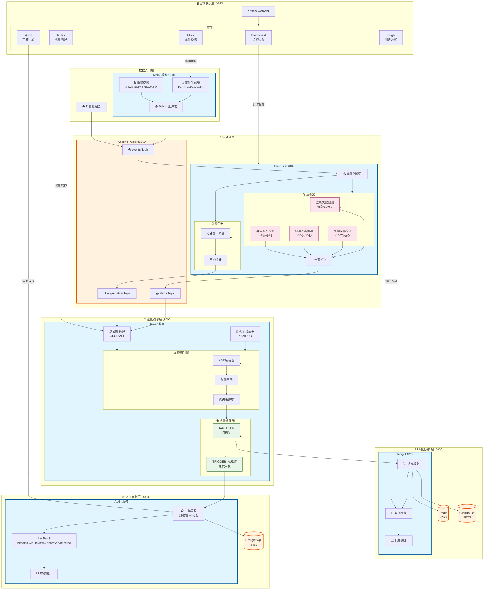

<h1 align="center">
  <br>
  <a href="#"></a>
  <br>
  BehaviorSense
  <br>
</h1>

<h4 align="center">用户行为流实时分析引擎</h4>

<p align="center">
  <a href="#-解决什么问题">解决问题</a> •
  <a href="#-为什么选择-behaviorsense">为什么选择</a> •
  <a href="#-核心特性">核心特性</a> •
  <a href="#-快速开始">快速开始</a> •
  <a href="#-架构设计">架构设计</a>
</p>

<p align="center">
  <a href="https://github.com/afine907/behavior-sense/actions/workflows/ci.yml">
    
  </a>
  <a href="https://www.python.org/downloads/">
    
  </a>
  <a href="LICENSE">
    
  </a>
  <a href="https://docs.astral.sh/ruff/">
    
  </a>
</p>

<p align="center">
  <a href="README.md">English</a> | <a href="README_CN.md">中文</a>
</p>

---

## 🎯 解决什么问题？

**实时检测用户行为中的欺诈、滥用和异常 —— 亚秒级延迟，自动决策。**

BehaviorSense 是一个生产就绪的引擎，处理用户行为事件（点击、购买、登录），通过灵活的规则引擎匹配，自动给用户打标签，并标记高风险事件供人工审核。

```
用户点击 → 流处理 → 规则匹配 → 自动打标 / 触发审核
    ↓           < 1 秒           ↓
 [Pulsar] ────→ [Faust] ────→ [决策] ────→ [动作]
```

---

## 💡 为什么选择 BehaviorSense？

| 痛点 | BehaviorSense 解决方案 |
|------|------------------------|
| **规则变更需要重新部署代码** | YAML/DB 热加载规则 — 无需重启 |
| **基于 SQL 的风控检测太慢** | AST 规则引擎毫秒级评估 |
| **误报需要人工介入** | 内置人工审核工作流 |
| **无法看到实时情况** | 实时仪表盘 + Prometheus 指标 |
| **单体架构难以扩展** | 微服务独立部署 |

### 🚀 创新点

- **⚡ 亚秒级延迟** — 从事件到决策 < 1 秒
- **🔥 规则热加载** — 无需重启即可新增/修改规则
- **🛡️ 安全规则解析** — 基于 AST 评估，防止代码注入
- **👥 人工介入** — 内置审核工作流处理高风险决策
- **📊 多层检测** — 预置登录失败、快速点击、异常购买检测器

---

## ✨ 核心特性

<table>
<tr>
<td width="50%">

### 🎯 规则引擎

```yaml
# rules/fraud_detection.yaml
- name: "高额购买预警"
  condition: "amount > 10000 and user_age_days < 7"
  priority: 10
  actions:
    - type: TAG_USER
      params: { tags: ["high_risk"] }
    - type: TRIGGER_AUDIT
      params: { level: "high" }
```

**支持热加载** — 修改规则无需重启服务

</td>
<td width="50%">

### 🔍 内置检测器

| 检测器 | 阈值 | 场景 |
|--------|------|------|
| 登录失败检测 | >5次/10分钟 | 暴力破解攻击 |
| 高频操作检测 | >100次/分钟 | 机器人行为 |
| 快速点击检测 | >20次/10秒 | 点击农场 |
| 异常购买检测 | >5次同商品/小时 | 倒卖/欺诈 |

</td>
</tr>
</table>

### 🏗️ 全栈解决方案

- **前端**: Next.js 仪表盘，监控与管理
- **后端**: 5 个 FastAPI 微服务 + Faust 流处理器
- **基础设施**: Pulsar、PostgreSQL、Redis、ClickHouse
- **可观测性**: Prometheus + Grafana 仪表盘

---

## 🚀 快速开始

### 环境要求

- Python 3.11+
- [uv](https://docs.astral.sh/uv/) 包管理器
- Docker & Docker Compose（基础设施）

### 5 分钟启动

```bash
# 1. 克隆项目
git clone https://github.com/afine907/behavior-sense.git
cd behavior-sense

# 2. 安装依赖
uv sync

# 3. 启动基础设施 (Pulsar, PostgreSQL, Redis 等)
docker compose -f infrastructure/docker/compose/base.yml up -d

# 4. 启动服务（在不同终端）
uv run uvicorn behavior_mock.main:app --port 8001      # 事件生成器
uv run python -m behavior_stream                        # 流处理器
uv run uvicorn behavior_rules.main:app --port 8002     # 规则引擎
uv run uvicorn behavior_insight.main:app --port 8003   # 用户洞察
uv run uvicorn behavior_audit.main:app --port 8004     # 审核服务

# 5. 打开前端
cd apps/web && pnpm install && pnpm dev
# → http://localhost:5143
```

### 生成测试事件

```bash
# 启动正常流量场景
curl -X POST http://localhost:8001/api/mock/scenario/start \
  -H "Content-Type: application/json" \
  -d '{"scenario_type": "normal", "rate_per_second": 100}'
```

---

## 📐 架构设计



---

## 🛠️ 技术栈

| 层级 | 技术 | 原因 |
|------|------|------|
| **运行时** | Python 3.11+ | 异步支持、类型提示 |
| **包管理** | [uv](https://docs.astral.sh/uv/) | 比 pip 快 10 倍 |
| **Web 框架** | FastAPI | 异步、OpenAPI、类型安全 |
| **前端** | Next.js 14 | React、SSR、App Router |
| **流处理** | Faust | Python 中的 Kafka 流处理 |
| **消息队列** | Apache Pulsar | 多租户、异地复制 |
| **数据库** | PostgreSQL | ACID、可靠 |
| **缓存** | Redis | 快速、支持发布订阅 |
| **分析** | ClickHouse | OLAP 行为分析 |
| **监控** | Prometheus + Grafana | 行业标准 |

---

## 📖 文档

| 文档 | 说明 |
|------|------|
| [架构设计](wiki/architecture.md) | 系统架构深度解析 |
| [模块设计](wiki/modules.md) | 服务职责划分 |
| [技术选型](wiki/technology.md) | 技术选择说明 |
| [API 设计](wiki/api.md) | REST API 规范 |
| [部署指南](wiki/deployment.md) | 生产环境部署 |
| [最佳实践](wiki/best-practices.md) | FastAPI、Pydantic、SQLAlchemy 模式 |

---

## 🧪 测试

```bash
# 快速测试（无外部依赖）
uv run pytest tests/test_api/test_mock_api.py tests/test_api/test_rules_api.py -v

# 完整集成测试（需要 Docker）
docker compose -f infrastructure/docker/compose/test.yml up -d
TEST_REAL_DEPS=1 uv run pytest tests/ -v

# 带覆盖率
uv run pytest tests/ --cov=libs --cov=packages --cov-report=html
```

---

## 🤝 参与贡献

欢迎参与贡献！请遵循 [贡献指南](CONTRIBUTING.md)。

### 提交规范

所有提交必须遵循 [Conventional Commits](https://www.conventionalcommits.org/)：

```
feat(audit): add audit state machine for review workflow
fix(rules): prevent eval injection with AST parser
docs(api): update endpoint documentation
```

---

## 📄 许可证

MIT 许可证 - 详见 [LICENSE](LICENSE)。

---

<p align="center">
  <b>觉得有用？给个 Star ⭐ 吧！</b>
</p>
