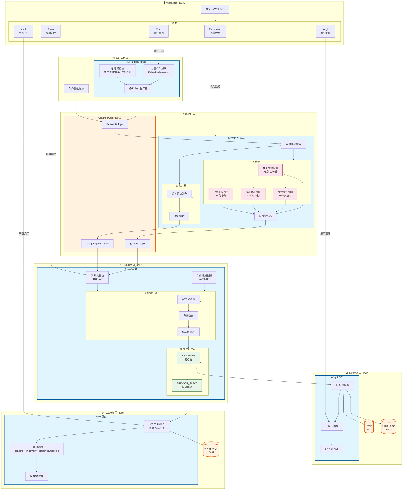

# BehaviorSense

[](https://github.com/afine907/behavior-sense/actions/workflows/ci.yml)
[](https://www.python.org/downloads/)
[](LICENSE)
[](https://docs.astral.sh/ruff/)

**用户行为流实时分析引擎** - 面向低延迟事件处理、灵活规则匹配与智能用户打标的实时平台。

[English](README.md) | [中文](README_CN.md)

---

## 概述

BehaviorSense 是一个用户行为流实时分析引擎，专为低延迟（< 1秒）事件处理、灵活规则匹配和智能用户打标设计。

### 核心特性

- **实时流处理** - 基于 Faust 构建的亚秒级延迟事件处理
- **灵活规则引擎** - 基于 AST 的规则解析，支持热重载
- **智能打标** - 自动用户画像与标签管理
- **人工审核流程** - 内置审核工作流支持
- **Monorepo 架构** - 清晰的关注点分离与共享库设计
- **现代 Python 技术栈** - FastAPI、Pydantic v2、全异步

### 系统架构



#### 数据流说明

| 阶段 | 组件 | 功能 |
|------|------|------|
| **入口** | Mock/External | 生成测试事件或接收外部行为数据 |
| **传输** | Pulsar | 高吞吐消息队列，支持事件持久化 |
| **处理** | Stream | 实时聚合 + 异常模式检测 |
| **决策** | Rules | AST 规则引擎，支持热加载 |
| **洞察** | Insight | 用户画像 + 自动打标签 |
| **审核** | Audit | 人工介入处理高风险事件 |

## 技术栈

| 组件 | 技术 | 用途 |
|------|------|------|
| 编程语言 | Python 3.11+ | 后端运行时 |
| 包管理器 | [uv](https://docs.astral.sh/uv/) | Python 依赖管理 |
| Web 框架 | FastAPI | REST API 服务 |
| 前端框架 | Next.js 14 | Web 应用 |
| 流处理 | Faust | 实时事件处理 |
| 消息队列 | Apache Pulsar | 事件流 |
| 数据库 | PostgreSQL | 持久化存储 |
| 缓存 | Redis | 缓存与发布订阅 |
| 分析 | ClickHouse | OLAP 查询 |
| 搜索 | Elasticsearch | 全文搜索 |
| 监控 | Prometheus + Grafana | 指标采集与可视化 |

## 项目结构

```
behavior-sense/
├── libs/                     # 共享库
│   └── core/                 # behavior-core
│       └── src/behavior_core/
│           ├── config/       # 配置管理
│           ├── metrics/      # Prometheus 指标
│           ├── middleware/   # 限流、链路追踪
│           ├── models/       # 数据模型
│           ├── security/     # 认证与 JWT
│           └── utils/        # 工具函数
│
├── packages/                 # 微服务
│   ├── mock/                 # behavior-mock (端口 8001)
│   ├── rules/                # behavior-rules (端口 8002)
│   ├── insight/              # behavior-insight (端口 8003)
│   ├── audit/                # behavior-audit (端口 8004)
│   └── stream/               # behavior-stream (Faust)
│
├── apps/                     # 前端应用
│   └── web/                  # Next.js Web 应用 (端口 5143)
│       └── src/
│           ├── app/          # Next.js 应用路由
│           ├── components/   # React 组件
│           ├── lib/          # 工具函数与 API 客户端
│           └── types/        # TypeScript 类型定义
│
├── infrastructure/           # 基础设施配置
│   └── docker/               # Dockerfile、docker-compose
│
├── tests/                    # 测试套件
│   ├── test_api/             # API 测试
│   ├── test_core/            # 核心库测试
│   ├── test_integration/     # 集成测试
│   ├── test_mock/            # Mock 服务测试
│   ├── test_rules/           # 规则引擎测试
│   ├── test_stream/          # 流处理器测试
│   ├── test_insight/         # Insight 服务测试
│   ├── test_audit/           # Audit 服务测试
│   └── performance/          # Locust 性能测试
│
├── scripts/                  # 开发脚本
└── wiki/                     # 项目文档
```

## 快速开始

### 环境要求

- Python 3.11+
- [uv](https://docs.astral.sh/uv/) 包管理器
- Docker & Docker Compose

### 安装步骤

```bash
# 克隆仓库
git clone https://github.com/afine907/behavior-sense.git
cd behavior-sense

# 安装依赖
uv sync

# 复制环境配置
cp .env.example .env

# 启动基础设施服务
docker-compose up -d
```

### 运行服务

```bash
# 运行 mock 服务（生成测试事件）
uv run uvicorn behavior_mock.main:app --port 8001

# 运行流处理器
uv run python -m behavior_stream

# 运行 insight API
uv run uvicorn behavior_insight.main:app --port 8003

# 运行审核服务
uv run uvicorn behavior_audit.main:app --port 8004
```

### 运行测试

项目采用**双模式测试架构**，支持快速迭代与生产验证：

```bash
# Mock 模式（快速，无外部依赖）
uv run pytest tests/test_api/test_mock_api.py tests/test_api/test_rules_api.py tests/test_integration/test_basic_integration.py -v

# 真实依赖模式（需要 Docker）
docker-compose -f docker-compose.test.yml up -d
TEST_REAL_DEPS=1 uv run pytest tests/ -v
docker-compose -f docker-compose.test.yml down -v

# 运行覆盖率测试
uv run pytest tests/ --cov=libs --cov=packages --cov-report=html

# 使用测试脚本
./scripts/run_tests.sh           # Mock 模式
./scripts/run_tests.sh --real    # 真实依赖模式
./scripts/run_tests.sh --all     # 全部测试
```

| 模式 | 依赖 | 适用场景 |
|------|------|----------|
| Mock | 无 | 快速迭代、本地开发 |
| Real | Redis + PostgreSQL | CI 验证、上线前检查 |

详细测试文档请参阅 [tests/test_api/TEST_REPORT.md](tests/test_api/TEST_REPORT.md)。

## 服务端口

| 服务 | 端口 | 描述 |
|------|------|------|
| behavior-mock | 8001 | 事件生成器 |
| behavior-rules | 8002 | 规则引擎 API |
| behavior-insight | 8003 | 用户洞察 API |
| behavior-audit | 8004 | 审核工作流 API |
| web | 5143 | 前端 Web 应用 |
| Pulsar | 6650 | 消息队列 |
| PostgreSQL | 5432 | 数据库 |
| Redis | 6379 | 缓存 |
| ClickHouse | 8123 | 分析引擎 |
| Elasticsearch | 9200 | 搜索引擎 |
| Prometheus | 9090 | 指标采集 |
| Grafana | 3000 | 监控面板 |

## API 文档

各服务均提供 OpenAPI 文档：

- Mock: http://localhost:8001/docs
- Rules: http://localhost:8002/docs
- Insight: http://localhost:8003/docs
- Audit: http://localhost:8004/docs
- Web: http://localhost:5143

## 开发指南

### 添加依赖

```bash
# 添加到根项目
uv add httpx

# 添加到指定包
uv add --package behavior-audit httpx

# 添加开发依赖
uv add --group dev black
```

### 代码质量

```bash
# 代码检查
uv run ruff check libs/ packages/

# 代码格式化
uv run ruff format libs/ packages/

# 类型检查
uv run mypy libs/core/src packages/*/src
```

### Docker 构建

```bash
# 构建指定服务
docker build -f infrastructure/docker/Dockerfile --build-arg SERVICE=insight -t behaviorsense/insight:latest .
```

## 文档

- [架构设计](wiki/architecture.md)
- [模块设计](wiki/modules.md)
- [技术选型](wiki/technology.md)
- [API 设计](wiki/api.md)
- [部署指南](wiki/deployment.md)
- [最佳实践](wiki/best-practices.md)
- [开发计划](PLAN.md)

## 参与贡献

欢迎参与贡献！请遵循以下步骤：

1. Fork 本仓库
2. 创建功能分支 (`git checkout -b feature/amazing-feature`)
3. 使用 [Conventional Commits](https://www.conventionalcommits.org/) 规范提交
4. 推送到分支 (`git push origin feature/amazing-feature`)
5. 创建 Pull Request

### 提交规范

所有提交信息必须遵循 [Conventional Commits](https://www.conventionalcommits.org/) 规范：

```
<type>(<scope>): <description>

# 示例
feat(audit): add audit state machine for review workflow
fix(rules): prevent eval injection with AST parser
docs(api): update endpoint documentation
test(core): add unit tests for models
refactor: migrate to monorepo structure
```

## 许可证

本项目采用 MIT 许可证 - 详见 [LICENSE](LICENSE) 文件。
